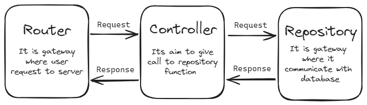

# Intro

This repo creates an API for a Flutter app that performs CRUD (create, read, update, and delete) operations for User and Post models. The API is deployed on `Render`, a cloud platform for web apps.

# Tech Stack

*   Backend code is written in `TypeScript`
*   Database: `MongoDB`
*   Server framework: `Express (for Node.js)`

#  Running the project

To run this project, you need to have `Node.js` and `npm` installed on your machine. You also need to have a `MongoDB` database running locally or remotely.

## Installation
First, clone this repository and navigate to the project folder:

```bash
git clone https://github.com/arnavaggarwal2012/tweez-backend.git
cd your-project 
```

Then, install the dependencies using npm:

```bash
 npm install 
 ```

 ## Configuration
 Next, create a `.env` file in the root directory of the project and add the following variables:

```bash 
MONGODB_URI=mongodb://localhost:27017/your-database # the connection string for the database 
 ```

You can change these values according to your preferences.

## Running
To start the server, run the following command:
```bash
npm start
```
## To test API through Postman

[](https://god.gw.postman.com/run-collection/27728698-0614d164-27d9-4fe3-9bfd-06d34466a9ad?action=collection%2Ffork&source=rip_markdown&collection-url=entityId%3D27728698-0614d164-27d9-4fe3-9bfd-06d34466a9ad%26entityType%3Dcollection%26workspaceId%3D6e3784c2-4fce-4905-abf6-4d326d8330c3)

Click Run in Postman button to fork collection used in this Project

# Schema of Project

<div style="text-align: center;">
    
</div>
<br>

User requests flow through the router to the controller, who talks to the repository for data. Repository intrects with database. Then prepares a response sent back through the controller and then router to the user. 

## Usage

This repo 2 API resources. `User` and `Tweet`. Each resource has four endpoints: GET, POST, PUT, and DELETE. There is one more route hello route. The URL for API ( will take 1 min to be active) is [`https://tweez-backend.onrender.com/api/v1/hello`](https://tweez-backend.onrender.com/api/v1/hello)

### User

The User resource represents a user of the app. A user has the following schema:

| Parameters | Description |
| --- | --- |
| userId | unique identifier for the user |
| tweets | user post(tweets) in array format |
| firstName | First Name of User |
| lastName | Last Name of User |
| email | Email of User |
| createdAt | UTC timing of Date Time |

### Tweet

The Tweet resource represents a tweet of the app. A user has the following schema:

| Parameters | Description |
| --- | --- |
| userId | unique identifier for the user |
| adminId | user post(tweets) in array format |
| content | First Name of User |
| createdAt | Last Name of User |

# Learnings
These my learning from this project
* How to create APIs
* Learned about various concept of Typescript
* Lost 10+ commits while making changing repo. Learnt about git stash to avoid in future project